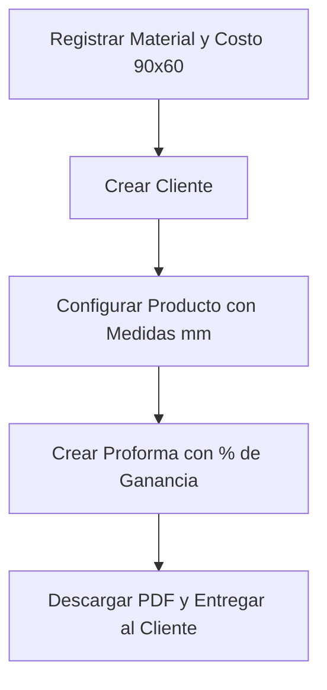

# 📘 Manual de Usuario Oficial — Laser Creation Tacna
**Sistema Integral de Presupuestación, Costeo Milimétrico y Gestión de Taller Láser**

---

## 📑 Tabla de Contenidos
1. [Introducción y Arquitectura](#1-introducción-y-arquitectura)
2. [Roles y Permisos de Acceso](#2-roles-y-permisos-de-acceso)
3. [Módulo a Módulo](#3-módulo-a-módulo)
   - [3.1 Dashboard](#31-dashboard)
   - [3.2 Directorio de Clientes](#32-directorio-de-clientes)
   - [3.3 Materiales y Planchas](#33-materiales-y-planchas)
   - [3.4 Complementos y Gastos Adicionales](#34-complementos-y-gastos-adicionales)
   - [3.5 Productos y Piezas Personalizadas](#35-productos-y-piezas-personalizadas)
   - [3.6 Proformas y Cotizaciones (Exportación PDF)](#36-proformas-y-cotizaciones-exportación-pdf)
   - [3.7 Gestión de Usuarios](#37-gestión-de-usuarios)
4. [El Motor de Costeo: Fórmulas Matemáticas](#4-el-motor-de-costeo-fórmulas-matemáticas)
5. [Guía Rápida: Flujo de Cotización de Inicio a Fin](#5-guía-rápida-flujo-de-cotización-de-inicio-a-fin)
6. [Solución de Problemas Frecuentes](#6-solución-de-problemas-frecuentes)

---

## 1. Introducción y Arquitectura

**Laser Creation Tacna** es una plataforma web desarrollada para automatizar el cálculo de presupuestos de corte y grabado láser. El sistema calcula con precisión milimétrica el costo de cada pieza, considerando:
- El rendimiento de las planchas enteras (divididas en formatos estándar 90×60 cm).
- El desgaste operativo y costos indirectos (% de gastos adicionales).
- Insumos y accesorios fijos (llaveros, pernos, cadenas).
- Margen de ganancia comercial para entrega inmediata de proformas en PDF al cliente.

---

## 2. Roles y Permisos de Acceso

El sistema maneja una jerarquía estricta de 3 niveles para resguardar la seguridad financiera del taller:

| Nivel | Rol | Identificador | Funciones y Alcance |
| :--- | :--- | :--- | :--- |
| **Nivel 2 (Super)** | **Super Administrador** | `@admin` | • Acceso total a todos los módulos. • Creación y eliminación de **otros Administradores** y **Usuarios**. • Modificación de fórmulas, costos de materiales y márgenes de ganancia. |
| **Nivel 2** | **Administrador** | Usuario con nivel 2 | • Acceso a la gestión de materiales, complementos, clientes, productos y proformas. • Solo puede crear **Usuarios Comunes** (nivel 1). No puede crear otros administradores. |
| **Nivel 1** | **Usuario / Operador** | Usuario con nivel 1 | • Acceso al Dashboard, Clientes, Productos y Proformas. • Elaboración de cotizaciones y registro de nuevos clientes. • Bloqueo total a la vista de gestión de usuarios y configuraciones maestras de costos. |

---

## 3. Módulo a Módulo

### 3.1 Dashboard
* **Propósito:** Brinda un resumen ejecutivo del estado del negocio.
* **Funciones:**
  * Contador de cotizaciones generadas y porcentaje de conversión de ventas.
  * Resumen de materiales activos y su costo por plancha 90×60 cm.
  * Acceso directo a la **Guía del Sistema** (botón flotante inferior derecho).

---

### 3.2 Directorio de Clientes
* **Ruta:** `/clientes`
* **Acciones:**
  * **Nuevo Cliente:** Haz clic en `+ Nuevo Cliente`, ingresa Nombre/Razón Social, Teléfono y Domicilio.
  * **Editar:** Modifica los datos de contacto en cualquier momento.
  * **Eliminar:** Limpia clientes antiguos. Gracias a la **eliminación en cascada**, el sistema removerá el cliente y sus cotizaciones asociadas de forma segura.

---

### 3.3 Materiales y Planchas
* **Ruta:** `/materiales`
* **Concepto Clave:** Es la base de todo el motor de costeo.
* **Campos:**
  1. **Descripción:** Nombre del material (ej. *Acrílico Transparente 3mm*, *MDF 3mm*).
  2. **Medidas de la Plancha:** Largo y ancho enteros de la plancha comprada (ej. 2440 × 1220 mm).
  3. **Inversión Total:** Precio de compra + Costo de envío + Costo de corte primario.
  4. **Planchas 90×60:** Número de piezas de 900×600 mm que rinde la plancha entera (ej. 5 unidades).
* **Cálculo Automático:** El sistema divide la inversión total entre el número de planchas 90×60 para obtener el **Costo 90×60**.

---

### 3.4 Complementos y Gastos Adicionales
* **Complementos (`/complementos`):** Insumos con costo unitario fijo (ej. argollas para llavero a S/ 0.20, pernos de aluminio a S/ 1.50).
* **Gastos Adicionales (`/gastos`):** Porcentajes aplicados sobre el valor del material consumido para cubrir luz, desgaste del tubo láser, cinta de transferencia y empaque (ej. 10% de desgaste operativo).

---

### 3.5 Productos y Piezas Personalizadas
* **Ruta:** `/productos`
* **Cómo crear un producto:**
  1. Haz clic en `+ Nuevo Producto`.
  2. Selecciona el **Material** a utilizar.
  3. Ingresa las dimensiones de corte en milímetros: **Largo (mm)** y **Ancho (mm)**.
  4. Agrega los complementos y gastos adicionales si aplican.
  5. Marca si deseas guardarlo como **Plantilla** para reutilizarlo en futuros pedidos (ej. *Llavero 50×50 mm*).

---

### 3.6 Proformas y Cotizaciones (Exportación PDF)
* **Ruta:** `/proformas`
* **Flujo de Cotización:**
  1. Haz clic en `+ Nueva Proforma`.
  2. Selecciona el **Cliente**.
  3. Añade uno o más productos con sus respectivas cantidades.
  4. Define el **% de Ganancia Comercial** (ej. 30% o 50%).
  5. El sistema calcula el **Precio Final**.
  6. Haz clic en **Generar PDF** para obtener un documento formal con membrete listo para enviar por WhatsApp o correo.

---

### 3.7 Gestión de Usuarios
* **Ruta:** `/usuarios` *(Solo visible para Administradores)*
* **Funcionalidad:**
  * **Super Administrador (`admin`):** Puede crear usuarios con rol *Administrador* o *Usuario Común*.
  * **Administradores:** Solo pueden registrar nuevos *Usuarios Comunes*.
  * **Protección:** La cuenta `@admin` principal está protegida y no puede ser eliminada.

---

## 4. El Motor de Costeo: Fórmulas Matemáticas

El sistema sigue la lógica matemática original validada para corte láser:

$$\text{Área 90×60} = 900 \times 600 = 540,000 \text{ mm}^2$$

$$\text{Costo del Material de la Pieza} = \frac{\text{Largo (mm)} \times \text{Ancho (mm)} \times \text{Costo 90×60}}{540,000}$$

$$\text{Costo Total} = \text{Costo Material} + \sum \text{Gastos Adicionales} + \sum \text{Complementos}$$

$$\text{Precio Final} = \text{Costo Total} \times \left(1 + \frac{\text{\% Ganancia}}{100}\right)$$

---

## 5. Guía Rápida: Flujo de Cotización de Inicio a Fin

---

## 6. Solución de Problemas Frecuentes

* **¿Cómo reabro el tutorial de bienvenida si lo cerré?**
  * Haz clic en el botón circular morado **"Guía del Sistema"** ubicado en la esquina inferior derecha de cualquier pantalla.
* **¿Por qué no puedo crear otro administrador?**
  * Solo el usuario principal `@admin` (Super Administrador) tiene permisos de seguridad para conceder el rango de Administrador.
* **¿Qué sucede al eliminar un material?**
  * La base de datos tiene habilitada la eliminación en cascada: se eliminarán automáticamente los productos y referencias dependientes.
