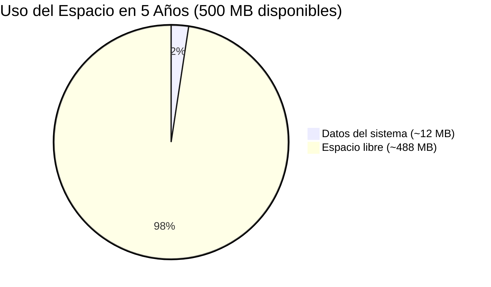
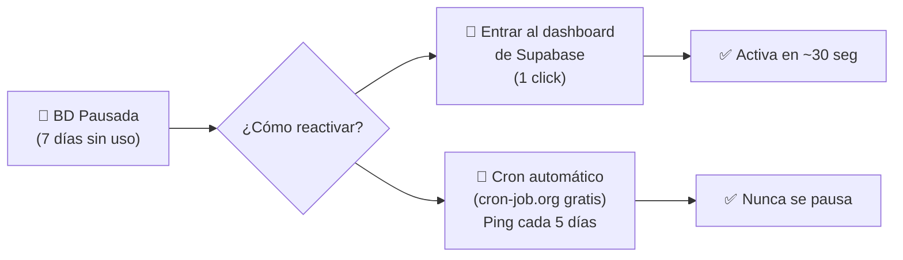

# 📊 ¿0.5 GB es Suficiente? — Cálculo Real de Espacio

## Laser Creation Tacna — Análisis de Almacenamiento

---

## 1. Tu Base de Datos ACTUAL (Visual FoxPro)

Medí la carpeta `Datos/` del sistema de tu tío. Esto es lo que tiene:

| Archivo | Tamaño |
|---|---|
| Todas las tablas `.dbf` (9 tablas) | **20.67 KB** |
| Todos los índices `.cdx` | 34.50 KB |
| Campos memo `.fpt` | 1.12 KB |
| **TOTAL carpeta Datos** | **94.46 KB (0.09 MB)** |

> [!NOTE]
> **Toda la base de datos actual ocupa menos de 0.1 MB.** 
> El límite gratuito es 500 MB. Eso es **5,000 veces** más espacio del que usa hoy.

---

## 2. Pero... ¿cuánto crecerá? Proyección a 5 años

Vamos a hacer un cálculo **pesimista** (asumiendo uso intensivo):

### Estimación por registro en PostgreSQL

| Tabla | Tamaño por fila | Registros/año (uso intensivo) | 5 años | Subtotal |
|---|---|---|---|---|
| `clientes` | ~150 bytes | 200 nuevos/año | 1,000 | **150 KB** |
| `materiales` | ~300 bytes | 30 nuevos/año | 150 | **45 KB** |
| `complementos` | ~200 bytes | 20 nuevos/año | 100 | **20 KB** |
| `gastos_adicionales` | ~120 bytes | 10 nuevos/año | 50 | **6 KB** |
| `productos` | ~500 bytes | 500 nuevos/año | 2,500 | **1.25 MB** |
| `adicional_productos` | ~200 bytes | 1,500/año (3 por producto) | 7,500 | **1.5 MB** |
| `complementos_productos` | ~180 bytes | 1,000/año (2 por producto) | 5,000 | **900 KB** |
| `proformas` | ~350 bytes | 300/año | 1,500 | **525 KB** |
| `listado_proforma` | ~150 bytes | 1,200/año (4 por proforma) | 6,000 | **900 KB** |
| `usuarios` | ~400 bytes | 5 total | 5 | **2 KB** |
| **Índices SQL** | ~2x datos | — | — | ~**5 MB** |

### 📦 TOTAL ESTIMADO EN 5 AÑOS

```
Datos puros:     ~5.3 MB
Índices SQL:     ~5.0 MB
Overhead PG:     ~2.0 MB
─────────────────────────
TOTAL:           ~12.3 MB
```



> [!TIP]
> **En 5 años de uso intensivo, apenas usarías el 2.5% del espacio gratuito.**
> 
> Para llenar 500 MB necesitarías ~200,000 productos con sus proformas. 
> Eso es como 40,000 productos por año, o **110 productos por día, todos los días, durante 5 años.**
> Una empresa de corte láser en Tacna no maneja esos volúmenes.

---

## 3. ¿Y las Imágenes?

> [!IMPORTANT]
> **Las imágenes NO van en la base de datos.** Van en un servicio de almacenamiento de archivos separado.

| Tipo de imagen | Dónde se guarda | Espacio en BD |
|---|---|---|
| Fotos de productos | Uploadthing / Cloudflare R2 / Supabase Storage | Solo la **URL** (~100 bytes) |
| Imágenes de proformas | Uploadthing / Cloudflare R2 / Supabase Storage | Solo la **URL** (~100 bytes) |
| Fotos de usuarios | Uploadthing / Cloudflare R2 / Supabase Storage | Solo la **URL** (~100 bytes) |

**En la BD solo guardas el link:**
```
https://uploadthing.com/f/abc123-foto-producto.jpg
```

**Espacio para imágenes (separado de la BD):**

| Servicio | Espacio gratis | ¿Cuántas fotos? (a 500KB cada una) |
|---|---|---|
| Uploadthing | 2 GB | ~4,000 fotos |
| Cloudflare R2 | 10 GB | ~20,000 fotos |
| Supabase Storage | 1 GB | ~2,000 fotos |

---

## 4. La Preocupación de Supabase: ¿Se Pausa Sola?

Entiendo tu preocupación. Analicemos los escenarios reales:

### ¿Cuándo se pausa Supabase?

> Se pausa **solo si NADIE** usa el sistema durante **7 días seguidos**.

### ¿Eso pasaría en el negocio de tu tío?

| Escenario | ¿Se pausa? | Razón |
|---|---|---|
| Tu tío usa el sistema de lunes a sábado | ❌ **No** | Hay actividad diaria |
| Tu tío se va de vacaciones 1 semana | ⚠️ **Podría** | 7 días sin uso |
| Fin de semana largo (3-4 días) | ❌ **No** | Son menos de 7 días |
| Solo usas el sistema 1 vez por semana | ❌ **No** | El contador se reinicia cada vez |

### Si se pausa, ¿qué pasa?



### ¿Y el cron automático, es confiable?

Sí, pero entiendo que agrega una pieza más que puede fallar. Es un punto válido.

---

## 5. Entonces... ¿Neon o Supabase?

| Criterio | 🟢 Neon | 🟢 Supabase |
|---|---|---|
| **¿Se pausa?** | Se "duerme" tras 5 min sin uso | Se pausa tras 7 DÍAS sin uso |
| **¿Se despierta sola?** | ✅ Sí, automáticamente en 500ms | ❌ No, hay que reactivarla |
| **¿Necesita cron?** | ❌ No | ⚠️ Recomendable para evitar pausas |
| **Auth incluido** | ❌ No (usas Auth.js aparte) | ✅ Sí |
| **Storage incluido** | ❌ No (usas Uploadthing aparte) | ✅ Sí (1 GB) |
| **Espacio BD gratis** | 0.5 GB | 500 MB |
| **Facilidad setup** | ⭐⭐⭐⭐ | ⭐⭐⭐⭐⭐ |

### Mi veredicto:

> **Si te preocupa la hibernación → usa Neon.** Se despierta sola en 500ms, sin configurar nada extra.
>
> **Si prefieres todo-en-uno y tu tío usa el sistema al menos 1 vez por semana → Supabase funciona perfecto** porque nunca llegaría a los 7 días de inactividad.

---

## 6. Comparación con MongoDB Atlas (lo que ya conoces)

Ya que mencionas que usas MongoDB Atlas en otros proyectos:

| Criterio | MongoDB Atlas Free | Neon Free | Supabase Free |
|---|---|---|---|
| **Espacio** | 512 MB | 512 MB | 500 MB |
| **Tipo BD** | NoSQL (documentos) | PostgreSQL (relacional) | PostgreSQL (relacional) |
| **¿Hiberna?** | Se pausa tras 60 min inactivo | Duerme tras 5 min, despierta en 500ms | Pausa tras 7 días |
| **Wake-up** | ~5-10 seg | ~0.5 seg ⭐ | Manual / Cron |
| **Mejor para** | Datos flexibles, JSON | Datos relacionales, cálculos | Todo-en-uno |

> [!IMPORTANT]
> **Para este sistema, PostgreSQL es mejor que MongoDB** porque los datos son altamente relacionales:
> - Productos → tienen → Materiales, Complementos, Gastos Adicionales
> - Proformas → contienen → Productos
> - Proformas → pertenecen a → Clientes
>
> Estas relaciones se manejan mucho más naturalmente con SQL que con documentos MongoDB. Además, los cálculos financieros (costos, porcentajes, totales) son más precisos y fáciles con PostgreSQL.

---

## 7. Resumen Final

```
📊 ESPACIO:
   ✅ 500 MB es SOBRADO para este sistema
   ✅ En 5 años usarías ~12 MB (2.5% del total)
   ✅ Las imágenes van en storage aparte (2-10 GB gratis)

🔌 HIBERNACIÓN:
   ✅ Neon: duerme pero despierta sola en 500ms (MEJOR opción)
   ⚠️ Supabase: se pausa si nadie usa en 7 días (workaround con cron)
   ❌ Render: hiberna tras 15 min, tarda 30-60 seg (lo que no te gusta)

🎯 RECOMENDACIÓN:
   → Vercel + Neon + Auth.js + Uploadthing
   → Sin hibernación perceptible
   → Sin necesidad de cron jobs
   → Sin necesidad de servidor propio
   → 100% gratis para el volumen de este negocio
```
