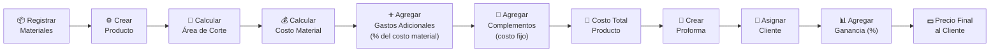
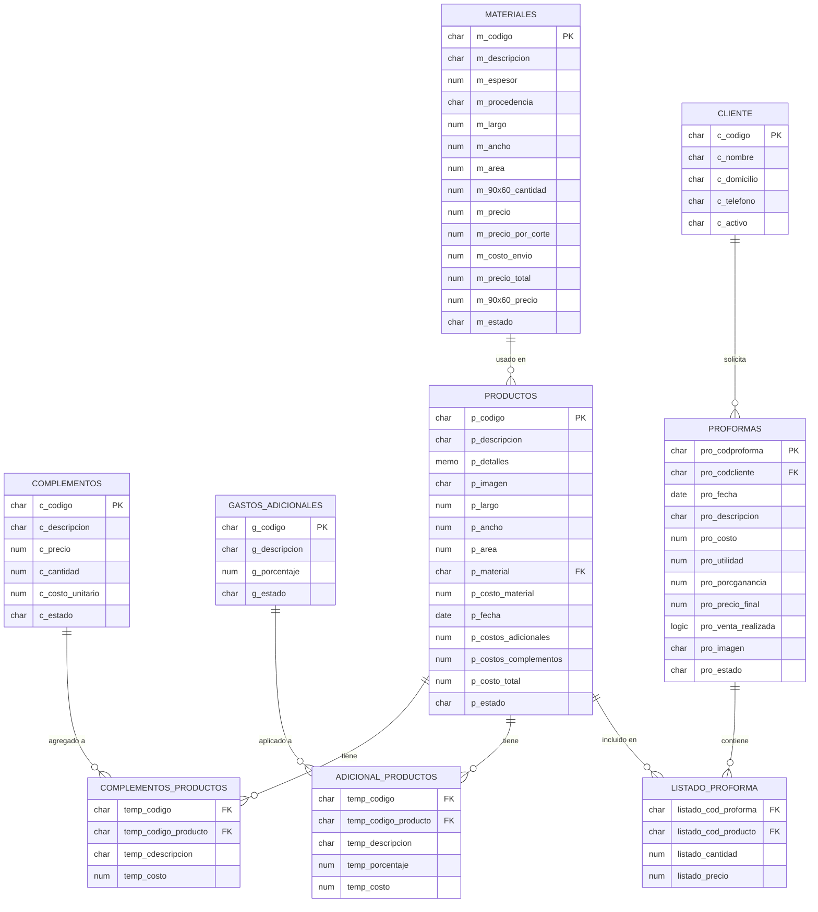
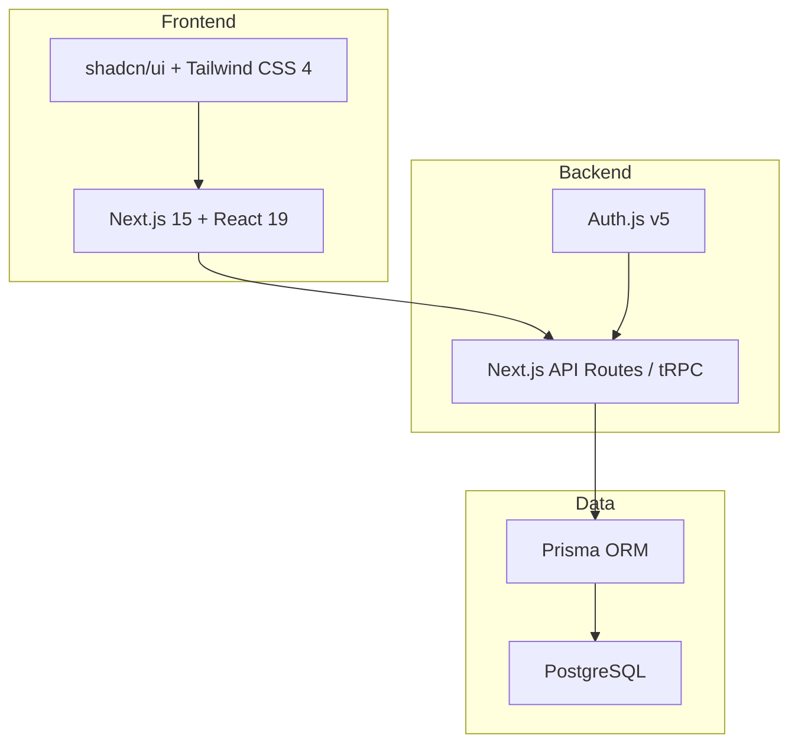
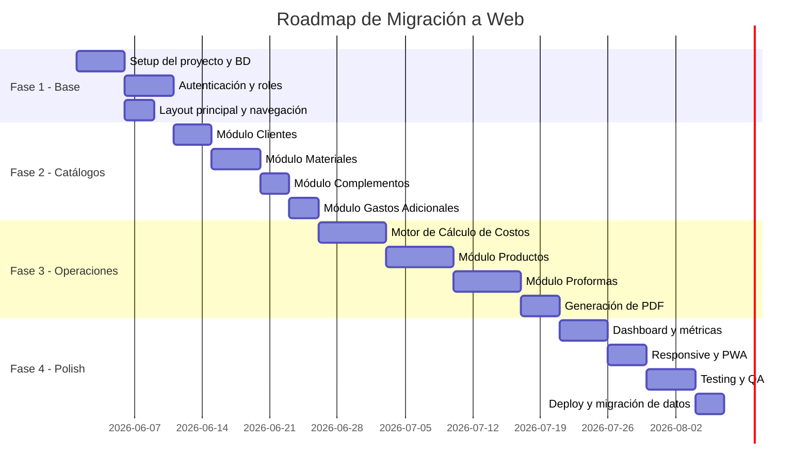

# 📋 Análisis del Sistema "Laser Creation Tacna" (LCT)

## Migración de Visual FoxPro (Escritorio) → Versión Web


---

## 1. ¿Qué es este Sistema?

**Laser Creation Tacna (LCT)** es un **Sistema de Cálculo de Costos** para una empresa de **corte láser** ubicada en Tacna, Perú. La empresa se dedica a fabricar productos personalizados cortados con láser sobre diferentes materiales (acrílico, MDF, cartón, etc.).

El sistema fue desarrollado en **Visual FoxPro 9** como aplicación de escritorio. Su función principal es:

> **Calcular el costo total de fabricación de un producto cortado con láser, incluyendo el material base, gastos adicionales (porcentuales) y complementos (costos fijos), para luego generar proformas/cotizaciones para los clientes.**

### Flujo de Negocio Principal



---

## 2. Arquitectura del Sistema Actual

### Stack Tecnológico Original

| Componente | Tecnología |
|---|---|
| Lenguaje | Visual FoxPro 9 |
| Base de Datos | DBF (tablas nativas FoxPro) |
| Interfaz | Formularios VFP (SCX/SCT) |
| Menú | Menú nativo VFP (MNX/MPR) |
| Clases UI | Librería visual VCX/VCT |
| Ejecutable | laser_creation_tacna.exe |
| DLLs | vfp9r.dll, gdiplus.dll, msvcr71.dll |
| Generación PDF | Librería PDF3.PRG |

### Estructura de Directorios

```
📁 Laser_creation_tacna/
├── 📁 Clases/          → Clases visuales reutilizables (botones, grids, forms)
├── 📁 Datos/           → Base de datos DBF (tablas + índices CDX)
├── 📁 Formularios/     → Pantallas del sistema (SCX/SCT)
├── 📁 Iconos/          → Imágenes e iconos de la UI (112 archivos)
├── 📁 imagenes/        → Imágenes de productos ejemplo
├── 📁 Menu/            → Menú principal del sistema
├── 📁 Prgs/            → Programas PRG (lógica principal, funciones, PDF)
├── 📄 laser_creation_tacna.exe  → Ejecutable compilado
└── 📄 productos.TXT    → Documentación de estructura de tabla
```

---

## 3. Módulos del Sistema

El sistema tiene **2 áreas principales** con **7 módulos**:

### 🗂️ Área: Mantenimiento (Catálogos)

#### 3.1 👤 Módulo de Clientes

**Propósito:** Registro y gestión de clientes que solicitan cotizaciones.

| Campo | Tipo | Descripción |
|---|---|---|
| `c_codigo` | Char(10) | Código único auto-generado (fecha + segundos) |
| `c_nombre` | Char | Nombre completo del cliente |
| `c_domicilio` | Char | Dirección del cliente |
| `c_telefono` | Char | Teléfono de contacto |
| `c_activo` | Char(1) | Estado: "1" = activo, "2" = eliminado (borrado lógico) |

**Operaciones:** Nuevo, Editar, Eliminar (lógico), Buscar.

---

#### 3.2 🧱 Módulo de Materiales

**Propósito:** Catálogo de materiales disponibles para corte láser (acrílico, MDF, cartón, etc.). Este es el **módulo más importante** porque define el costo base de cada producto.

| Campo | Tipo | Descripción |
|---|---|---|
| `m_codigo` | Char(10) | Código único |
| `m_descripcion` | Char | Nombre del material (ej: "Acrílico 3mm") |
| `m_espesor` | Num(10,2) | Espesor en mm |
| `m_procedencia` | Char | Origen del material |
| `m_largo` | Num(10,2) | Largo de la plancha completa (mm) |
| `m_ancho` | Num(10,2) | Ancho de la plancha completa (mm) |
| `m_area` | Num(10,2) | Área total de la plancha (largo × ancho) |
| `m_90x60_cantidad` | Num | Cuántas piezas de 900×600mm salen de la plancha |
| `m_precio` | Num(10,2) | Precio de compra de la plancha |
| `m_precio_por_corte` | Num(10,2) | Costo del servicio de corte |
| `m_costo_envio` | Num(10,2) | Costo de envío/transporte |
| `m_precio_total` | Num(10,2) | **= precio + precio_corte + costo_envio** |
| `m_90x60_precio` | Num(10,2) | **= precio_total / cantidad_90x60** (Costo por pieza 90×60) |
| `m_estado` | Char(1) | "1" = activo, "2" = eliminado |

> [!IMPORTANT]
> **Fórmula clave de costeo por pieza:**
> `costo_pieza_90x60 = (precio_plancha + corte + envío) / cantidad_piezas_90x60`
>
> Esta es la unidad base para calcular el costo del material en cada producto.

---

#### 3.3 🔧 Módulo de Complementos

**Propósito:** Servicios o accesorios adicionales con **costo fijo unitario** que se pueden agregar a un producto (ej: base, soporte, pintura, etc.).

| Campo | Tipo | Descripción |
|---|---|---|
| `c_codigo` | Char | Código único |
| `c_descripcion` | Char | Descripción del complemento |
| `c_precio` | Num | Precio total del lote/paquete |
| `c_cantidad` | Num | Cantidad en el lote |
| `c_costo_unitario` | Num | **= precio / cantidad** |
| `c_estado` | Char(1) | "1" = activo, "2" = eliminado |

---

#### 3.4 📊 Módulo de Gastos Adicionales

**Propósito:** Gastos que se calculan como **porcentaje del costo del material** (ej: mano de obra 15%, depreciación máquina 5%, electricidad 8%).

| Campo | Tipo | Descripción |
|---|---|---|
| `g_codigo` | Char | Código único |
| `g_descripcion` | Char | Descripción del gasto |
| `g_porcentaje` | Num | Porcentaje a aplicar sobre el costo del material |
| `g_estado` | Char(1) | "1" = activo, "2" = eliminado |

---

### ⚙️ Área: Operaciones

#### 3.5 📦 Módulo de Productos

**Propósito:** Creación y costeo de productos. Es el **corazón del sistema**.

| Campo | Tipo | Descripción |
|---|---|---|
| `p_codigo` | Char(10) | Código único del producto |
| `p_descripcion` | Char(60) | Descripción del producto |
| `p_detalles` | Memo | Detalles adicionales (campo largo) |
| `p_imagen` | Char(150) | Ruta a imagen del producto |
| `p_largo` | Num(10,2) | Largo de la pieza a cortar (mm) |
| `p_ancho` | Num(10,2) | Ancho de la pieza a cortar (mm) |
| `p_area` | Num(10,2) | Área de la pieza (largo × ancho) |
| `p_material` | Char(10) | Código del material seleccionado |
| `p_costo_material` | Num(10,2) | Costo del material para esta pieza |
| `p_fecha` | Date | Fecha de creación |
| `p_costos_adicionales` | Num(10,2) | Total de gastos adicionales |
| `p_costos_complementos` | Num(10,2) | Total de complementos |
| `p_costo_total` | Num(10,2) | **Costo total del producto** |
| `p_estado` | Char(1) | "1" = activo, "2" = eliminado |

> [!IMPORTANT]
> **Fórmula de cálculo del costo del material:**
> ```
> Área pieza = largo × ancho (en mm²)
> Área referencia = 900 × 600 = 540,000 mm²
> Costo material = (Área_pieza × costo_pieza_90x60) / 540,000
> ```
>
> **Fórmula de costo total del producto:**
> ```
> Costo Total = Costo Material + Σ(Gastos Adicionales) + Σ(Complementos)
> ```
>
> Donde cada gasto adicional = `(porcentaje × costo_material) / 100`

**Tablas auxiliares del producto:**

- `adicional_productos` → Relación producto ↔ gastos adicionales seleccionados
- `complementos_productos` → Relación producto ↔ complementos seleccionados

---

#### 3.6 📄 Módulo de Proformas (Cotizaciones)

**Propósito:** Generación de cotizaciones/proformas para clientes, agrupando uno o más productos y aplicando un margen de ganancia.

| Campo | Tipo | Descripción |
|---|---|---|
| `pro_codproforma` | Char | Código de la proforma |
| `pro_codcliente` | Char | Código del cliente |
| `pro_fecha` | Date | Fecha de la proforma |
| `pro_descripcion` | Char | Descripción de la proforma |
| `pro_costo` | Num | Costo total (suma de productos) |
| `pro_utilidad` | Num | Utilidad/ganancia en soles |
| `pro_porcganancia` | Num | Porcentaje de ganancia aplicado |
| `pro_precio_final` | Num | **= costo + utilidad** |
| `pro_venta_realizada` | Logic | ¿Se concretó la venta? |
| `pro_imagen` | Char | Imagen del proyecto |
| `pro_estado` | Char(1) | "1" = activa, "2" = eliminada |

**Tabla auxiliar:**

- `listado_proforma` → Productos incluidos en la proforma con cantidades

> [!NOTE]
> **Flujo de la proforma:**
> 1. Se selecciona un cliente (buscador con grid)
> 2. Se agregan productos del catálogo
> 3. Para cada producto se define cantidad y porcentaje de ganancia
> 4. Se calcula: `Precio Final = Costo × (1 + %Ganancia/100)`
> 5. Se puede marcar si la venta fue realizada (`chkVenta`)

---

#### 3.7 👥 Módulo de Usuarios

**Propósito:** Gestión de usuarios del sistema con niveles de acceso.

| Campo | Tipo | Descripción |
|---|---|---|
| `cod_user` | Char | Código único |
| `id_user` | Char | Nombre de usuario |
| `nombre_user` | Char | Nombre |
| `apepat_user` | Char | Apellido paterno |
| `apemat_user` | Char | Apellido materno |
| `dni_user` | Char | Documento de identidad |
| `fecnac_user` | Date | Fecha de nacimiento |
| `clave_user` | Char | Contraseña encriptada (Caesar cipher +2) |
| `nivel_user` | Num | 1 = Usuario normal, 2 = Administrador |
| `fecrea_user` | Date | Fecha de creación |
| `estado_user` | Char(1) | "1" = activo, "2" = eliminado |
| `foto_user` | Char | Ruta a foto del usuario |
| `acceso_user` | Logic | Acceso concedido |

> [!WARNING]
> La encriptación actual es un simple **César cipher** que suma +2 al código ASCII de cada carácter. En la versión web se debe usar un algoritmo seguro como **bcrypt** o **argon2**.

---

## 4. Diagrama de Base de Datos



---

## 5. Características de la UI Actual

- **Patrón CRUD estándar:** Cada formulario tiene botones: Nuevo, Editar, Eliminar, Aceptar (Guardar), Cancelar, Salir
- **Iconos con estados:** Cada botón tiene versión habilitada y deshabilitada (cambio visual)
- **Grids (tablas):** Para listar registros con selección por fila
- **Formularios tipo FormSet:** Múltiples ventanas agrupadas (formulario principal + subformularios como buscador de clientes, visor de imagen, calculadora de ganancia)
- **Borrado lógico:** Los registros no se eliminan, se marcan con estado "2"
- **Validación en front:** Mensajes de confirmación ("¿Estás seguro?") antes de eliminar
- **Tema visual:** Fondo azul con el logo LCT, iconos personalizados

---

## 6. Recomendaciones de Tecnologías para la Versión Web

A continuación presento **4 grupos de tecnologías** organizados por filosofía/característica:

---

### 🏆 Grupo A — "STACK RECOMENDADO" (Balance perfecto)

> La opción que yo recomiendo. Equilibra productividad, estabilidad y comunidad.

| Capa | Tecnología | Justificación |
|---|---|---|
| **Frontend** | [**Next.js 15**](https://nextjs.org/) + React 19 | Framework fullstack más popular del mundo. Server Components, SSR/SSG, API Routes integradas |
| **UI** | [**shadcn/ui**](https://ui.shadcn.com/) + Tailwind CSS 4 | Componentes modernos, accesibles, personalizables. No es librería: es código que copias a tu proyecto |
| **Backend** | **Next.js API Routes** (o tRPC) | Al estar integrado en Next.js, no necesitas servidor aparte |
| **Base de Datos** | [**PostgreSQL**](https://www.postgresql.org/) | La BD relacional más robusta y gratuita. Perfecta para datos financieros |
| **ORM** | [**Prisma**](https://www.prisma.io/) | ORM moderno, tipado, con migraciones automáticas. Trabaja perfecto con Next.js |
| **Autenticación** | [**NextAuth.js v5**](https://authjs.dev/) (Auth.js) | Autenticación completa con sesiones, roles, providers. Gratis y seguro |
| **Deploy** | [**Vercel**](https://vercel.com/) / [**Railway**](https://railway.app/) | Deploy con un click, HTTPS, dominio personalizado. Free tier generoso |
| **Lenguaje** | TypeScript | Tipado estático = menos bugs, mejor autocompletado |



> [!TIP]
> **¿Por qué lo recomiendo?**
> - 📚 La **mayor comunidad** y documentación en español
> - 🔧 **Un solo framework** para frontend y backend
> - 🚀 Deploy en **minutos** con Vercel
> - 💰 Se puede empezar **100% gratis**
> - 🎨 shadcn/ui produce UIs **modernas y profesionales** sin esfuerzo

---

### 🚀 Grupo B — "MODERNO / BLEEDING-EDGE" (Tecnologías nuevas y eficientes)

> Para los que quieren usar lo más nuevo y performante del ecosistema.

| Capa | Tecnología | Justificación |
|---|---|---|
| **Frontend** | [**SvelteKit 2**](https://kit.svelte.dev/) | Framework más rápido, sintaxis simple, menos boilerplate que React |
| **UI** | [**Skeleton UI**](https://www.skeleton.dev/) o [**Melt UI**](https://melt-ui.com/) | Componentes nativos para Svelte, modernos y ligeros |
| **Backend** | **SvelteKit Endpoints** | Fullstack nativo, server-side rendering |
| **Base de Datos** | [**Turso**](https://turso.tech/) (SQLite edge) | SQLite distribuido, ultra rápido, gratis hasta 9GB |
| **ORM** | [**Drizzle ORM**](https://orm.drizzle.team/) | ORM liviano, SQL-like, más rendimiento que Prisma |
| **Autenticación** | [**Lucia Auth**](https://lucia-auth.com/) | Librería minimalista y segura |
| **Deploy** | [**Cloudflare Pages**](https://pages.cloudflare.com/) | Edge computing, CDN global gratis |
| **Runtime** | [**Bun**](https://bun.sh/) | Runtime de JS más rápido (reemplaza Node.js) |

> [!NOTE]
> **Ventajas:** Máximo rendimiento, bundle sizes mínimos, sintaxis más limpia.
> **Riesgo:** Comunidad más pequeña, menos tutoriales en español.

---

### 🏢 Grupo C — "ESTABLE EMPRESARIAL" (Máxima madurez y soporte)

> Para quienes priorizan estabilidad a largo plazo y facilidad de encontrar desarrolladores.

| Capa | Tecnología | Justificación |
|---|---|---|
| **Frontend** | [**Angular 19**](https://angular.dev/) | Framework enterprise de Google, tipado nativo, opinado |
| **UI** | [**Angular Material**](https://material.angular.io/) o [**PrimeNG**](https://primeng.org/) | Componentes robustos, tablas avanzadas, formularios reactivos |
| **Backend** | [**NestJS**](https://nestjs.com/) | Framework backend enterprise para Node.js (inspirado en Spring/Angular) |
| **Base de Datos** | [**PostgreSQL**](https://www.postgresql.org/) + [**MySQL**](https://www.mysql.com/) | Cualquiera de las dos, ambas maduras y empresariales |
| **ORM** | [**TypeORM**](https://typeorm.io/) | ORM enterprise con decorators y migraciones |
| **Autenticación** | [**Passport.js**](https://www.passportjs.org/) + JWT | La librería más madura para auth en Node.js |
| **Deploy** | [**AWS**](https://aws.amazon.com/) / [**DigitalOcean**](https://www.digitalocean.com/) | Hosting empresarial con control total |

> [!NOTE]
> **Ventajas:** Arquitectura más formal, fácil encontrar programadores, escalable.
> **Desventaja:** Más código boilerplate, curva de aprendizaje más alta.

---

### ⚡ Grupo D — "LIGERO Y RÁPIDO" (Mínima complejidad, máxima velocidad de desarrollo)

> Para comenzar rápido con mínimo setup. Ideal si el equipo es pequeño.

| Capa | Tecnología | Justificación |
|---|---|---|
| **Frontend** | [**Vue 3**](https://vuejs.org/) + [**Nuxt 3**](https://nuxt.com/) | Curva de aprendizaje más suave, sintaxis intuitiva |
| **UI** | [**Vuetify 3**](https://vuetifyjs.com/) o [**Naive UI**](https://www.naiveui.com/) | Componentes Material Design listos para usar, tablas potentes |
| **Backend** | [**Nuxt 3 Server**](https://nuxt.com/docs/guide/directory-structure/server) o [**Supabase**](https://supabase.com/) | Nuxt incluye server endpoints; Supabase es un "backend completo" ya hecho |
| **Base de Datos** | [**Supabase**](https://supabase.com/) (PostgreSQL) | Base de datos + Auth + Storage + Realtime en un solo servicio. Free tier generoso |
| **ORM** | **Supabase Client** (genera tipos automáticamente) | Sin ORM tradicional, queries directas con tipos |
| **Autenticación** | **Supabase Auth** | Login, registro, roles, magic links, OAuth todo incluido |
| **Deploy** | [**Netlify**](https://www.netlify.com/) + Supabase | Setup en minutos |

> [!TIP]
> **Ventajas:** Desarrollo más rápido posible, Supabase elimina 80% del trabajo backend.
> **Desventaja:** Dependencia de Supabase como servicio externo.

---

## 7. Comparativa Rápida de Stacks

| Criterio | 🏆 A: Recomendado | 🚀 B: Moderno | 🏢 C: Enterprise | ⚡ D: Ligero |
|---|---|---|---|---|
| **Velocidad de desarrollo** | ⭐⭐⭐⭐ | ⭐⭐⭐ | ⭐⭐ | ⭐⭐⭐⭐⭐ |
| **Rendimiento** | ⭐⭐⭐⭐ | ⭐⭐⭐⭐⭐ | ⭐⭐⭐ | ⭐⭐⭐⭐ |
| **Comunidad/Docs** | ⭐⭐⭐⭐⭐ | ⭐⭐⭐ | ⭐⭐⭐⭐ | ⭐⭐⭐⭐ |
| **Curva aprendizaje** | Media | Alta | Alta | Baja |
| **Escalabilidad** | Alta | Alta | Muy alta | Media |
| **Costo hosting** | Gratis → $20/mes | Gratis → $5/mes | $10 → $50/mes | Gratis → $25/mes |
| **Ideal para** | Proyecto serio con 1-3 devs | Devs experimentados | Empresas/equipos grandes | Prototipos / 1 dev |

---

## 8. Funcionalidades Clave a Replicar en la Web

### ✅ CRUD Estándar (todos los módulos)
- [ ] Listar registros con paginación y búsqueda
- [ ] Crear nuevo registro
- [ ] Editar registro existente
- [ ] Eliminar registro (borrado lógico)
- [ ] Validaciones de formulario

### ✅ Cálculos del Motor de Costos
- [ ] Cálculo automático de costo por pieza 900×600
- [ ] Cálculo de área de corte personalizada
- [ ] Aplicación de gastos adicionales por porcentaje
- [ ] Agregación de complementos por costo fijo
- [ ] Totalización automática del costo del producto

### ✅ Sistema de Proformas
- [ ] Buscador de clientes con autocompletado
- [ ] Selección de productos del catálogo
- [ ] Definición de cantidad y porcentaje de ganancia por producto
- [ ] Cálculo del precio final
- [ ] Marcar proforma como venta realizada
- [ ] Exportar proforma a PDF

### ✅ Sistema de Usuarios
- [ ] Login / Logout seguro
- [ ] Roles: Administrador vs Usuario Normal
- [ ] Restricción de acceso por rol
- [ ] Gestión de usuarios (CRUD)
- [ ] Encriptación segura de contraseñas (bcrypt)

### 🆕 Mejoras para la Versión Web
- [ ] Dashboard con métricas (ventas del mes, productos más cotizados, etc.)
- [ ] Responsive design (funcionar en celular y tablet)
- [ ] Notificaciones en tiempo real
- [ ] Historial de cambios (auditoría)
- [ ] Backup automático de base de datos
- [ ] Subida de imágenes de productos al servidor/nube
- [ ] Multi-usuario simultáneo (el sistema VFP era exclusivo)

---

## 9. Roadmap Sugerido de Migración



**Tiempo estimado total:** 8-10 semanas (1 desarrollador full-time)

---

## 10. Datos para Migrar

Se necesitará un script de migración que:
1. Lea las tablas DBF del sistema actual
2. Transforme los datos al schema de la nueva BD (PostgreSQL)
3. Migre imágenes al almacenamiento en la nube (o servidor)
4. Re-encripte las contraseñas con bcrypt

> [!CAUTION]
> Las tablas DBF actuales contienen índices CDX que el sistema FoxPro usa para búsquedas rápidas. En la versión web, estos se reemplazan por índices SQL nativos de PostgreSQL.

---

> **Documento generado el 19 de mayo de 2026**
> **Sistema analizado:** Laser Creation Tacna v1.0 (Visual FoxPro 9)
> **Objetivo:** Migración a versión Web
