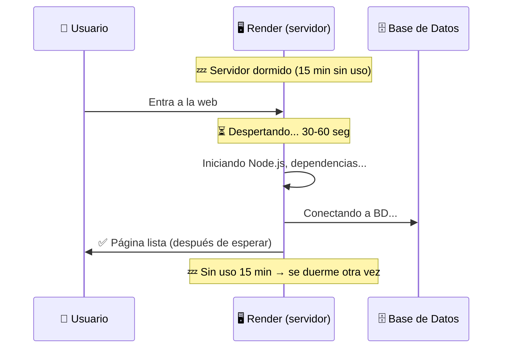
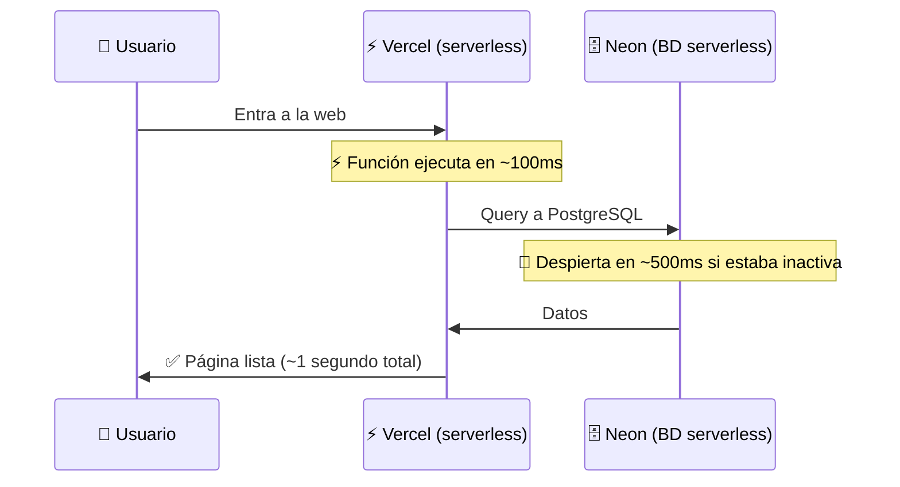
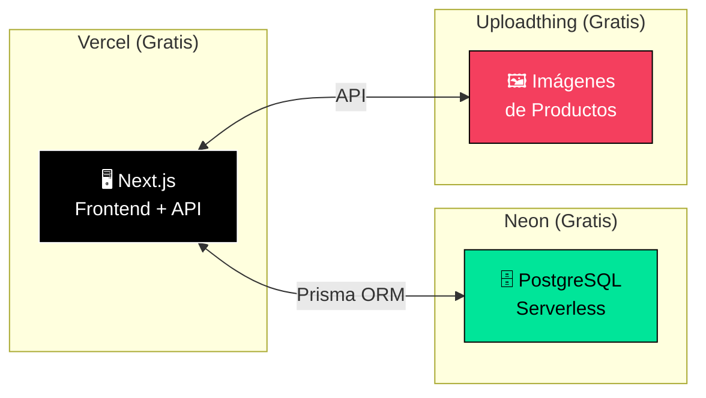
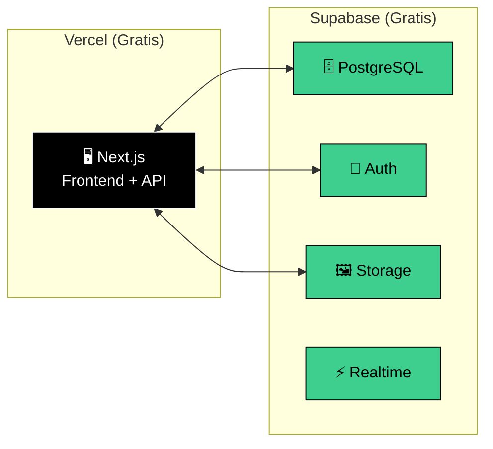
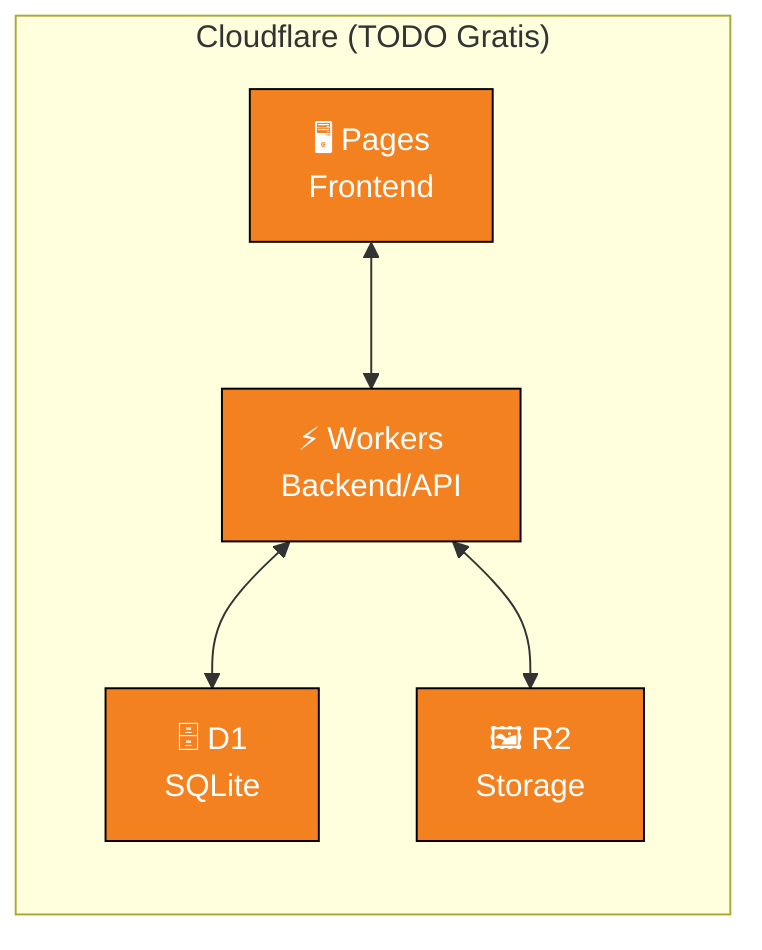
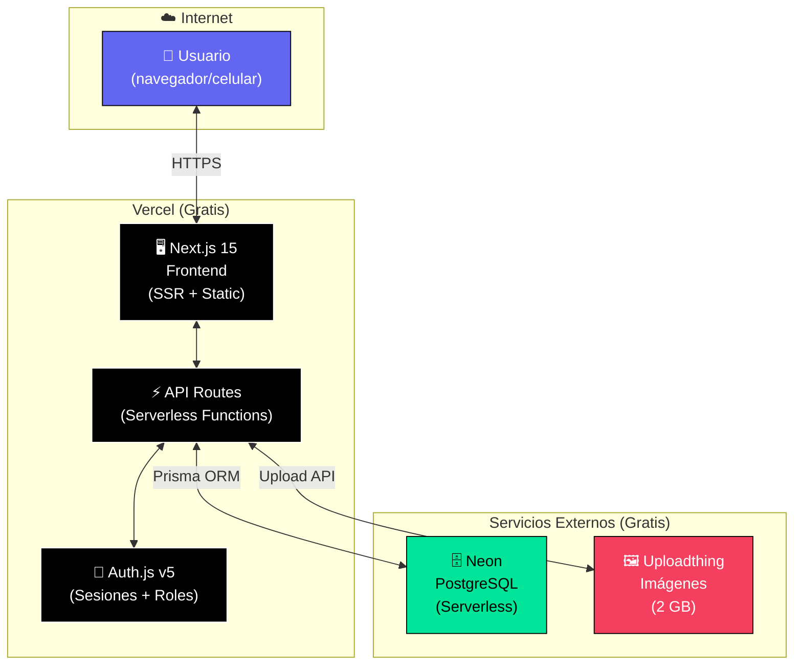

# 🌐 Estrategia de Despliegue 100% Gratuito — Sin Hibernación

## Laser Creation Tacna — Versión Web

---

## El Problema con Render (y por qué hiberna)

Render usa **servidores tradicionales (contenedores)**. En el plan gratuito, cuando nadie usa tu app por 15 minutos, el servidor **se apaga** para ahorrar recursos. Cuando alguien entra, tiene que **encender de nuevo** (30-60 segundos de espera).



---

## La Solución: Arquitectura Serverless

En vez de un servidor que está "prendido o apagado", usamos **funciones serverless**. Estas funciones:

- ✅ **No se duermen** — se ejecutan bajo demanda
- ✅ **No necesitan un servidor propio** — la plataforma las gestiona
- ✅ **Arrancan en milisegundos** (no 30-60 segundos)
- ✅ **Escalan automáticamente** — si entran 10 o 10,000 usuarios



---

## 3 Combos de Hosting Gratuito Comparados

### 🏆 COMBO A — "EL RECOMENDADO" (Vercel + Neon)

> **Mi recomendación #1.** La mejor experiencia de desarrollo con Next.js.

| Servicio | Función | Free Tier |
|---|---|---|
| [**Vercel**](https://vercel.com) | Frontend + Backend (API Routes) | 100 GB ancho de banda/mes, funciones serverless |
| [**Neon**](https://neon.tech) | Base de datos PostgreSQL | 0.5 GB almacenamiento, 100 horas compute/mes |
| [**Auth.js**](https://authjs.dev) | Autenticación | Librería open-source, sin límites |
| [**Uploadthing**](https://uploadthing.com) | Subida de imágenes | 2 GB gratis |



**¿Hiberna?**
- **Vercel:** ❌ NO hiberna. Las funciones serverless se ejecutan al instante.
- **Neon:** Se "apaga" tras 5 min de inactividad, pero **despierta en ~500ms** (imperceptible para el usuario). No es como Render que tarda 30-60 segundos.

> [!TIP]
> **¿Por qué Neon y no Render PostgreSQL?**
> Neon es una BD "serverless" — se apaga para no consumir, pero al hacer un query **responde en medio segundo**. El usuario jamás nota la diferencia. Render en cambio reinicia todo el contenedor (30-60 seg).

---

### 🔋 COMBO B — "TODO EN UNO" (Vercel + Supabase)

> La opción más fácil. Supabase te da BD + Auth + Storage en un solo lugar.

| Servicio | Función | Free Tier |
|---|---|---|
| [**Vercel**](https://vercel.com) | Frontend + Backend | 100 GB ancho de banda/mes |
| [**Supabase**](https://supabase.com) | BD + Auth + Storage + Realtime | 500 MB BD, 1 GB archivos, 50K usuarios/mes |



**¿Hiberna?**

> [!WARNING]
> Supabase **pausa el proyecto completo** después de **7 días sin actividad**. Es peor que Render en ese sentido, porque no se despierta automáticamente — hay que ir al dashboard a reactivarlo manualmente.
>
> **Solución:** Configurar un cron job gratuito (ej: con [cron-job.org](https://cron-job.org)) que haga un ping a tu BD cada 5 días para mantenerla viva. Esto funciona perfectamente.

---

### ☁️ COMBO C — "MÁXIMO GRATIS" (Cloudflare Pages + D1)

> La opción más generosa en límites. Cero cold starts. Ideal para máximo rendimiento.

| Servicio | Función | Free Tier |
|---|---|---|
| [**Cloudflare Pages**](https://pages.cloudflare.com) | Frontend + Backend (Workers) | Ancho de banda ilimitado, 100K requests/día |
| [**Cloudflare D1**](https://developers.cloudflare.com/d1/) | Base de datos SQLite | 5 GB total, 5M lecturas/día, 100K escrituras/día |
| [**Cloudflare R2**](https://developers.cloudflare.com/r2/) | Almacenamiento de archivos | 10 GB gratis |



**¿Hiberna?**
- ❌ **NUNCA hiberna.** Cloudflare usa "V8 isolates" (no contenedores), así que no hay nada que apagar. Es la opción con **cero cold starts**.

> [!IMPORTANT]
> **Limitaciones:**
> - D1 usa **SQLite** (no PostgreSQL). Es más limitado pero suficiente para tu sistema.
> - Workers tiene restricciones con algunos paquetes de Node.js.
> - La curva de aprendizaje de Cloudflare es más pronunciada.
> - Menos tutoriales y comunidad en español.

---

## Tabla Comparativa Final

| Criterio | 🏆 A: Vercel + Neon | 🔋 B: Vercel + Supabase | ☁️ C: Cloudflare |
|---|---|---|---|
| **¿Hiberna?** | BD duerme 5min, despierta en 500ms | BD pausa tras 7 días sin uso | ❌ Nunca |
| **Percepción usuario** | Imperceptible | Requiere workaround (cron) | Instantáneo |
| **BD** | PostgreSQL ⭐ | PostgreSQL ⭐ | SQLite |
| **Almacenamiento BD** | 0.5 GB | 500 MB | 5 GB ⭐ |
| **Auth** | Auth.js (tú lo configuras) | Incluido ⭐ | Tú lo configuras |
| **Storage imágenes** | Uploadthing (2 GB) | Incluido 1 GB | R2 (10 GB) ⭐ |
| **Ancho de banda** | 100 GB/mes | 100 GB/mes | Ilimitado ⭐ |
| **Facilidad** | ⭐⭐⭐⭐ | ⭐⭐⭐⭐⭐ | ⭐⭐⭐ |
| **Docs en español** | Muchos ⭐ | Muchos ⭐ | Pocos |
| **Framework ideal** | Next.js | Next.js | SvelteKit / Next.js |
| **¿Sirve para tu tesis?** | ✅ Sí | ✅ Sí | ✅ Sí |

---

## 🎯 Mi Recomendación Final

Para tu situación (estudiante de ingeniería, sin servidor propio, sistema de tu tío):

### → **Combo A: Vercel + Neon** con Next.js

**¿Por qué?**

1. **Sin hibernación molesta** — Neon despierta en 500ms, no como Render (30-60s)
2. **PostgreSQL real** — Ideal para datos financieros y cálculos de costos
3. **Un solo deploy** — Frontend + Backend en Vercel con `git push`
4. **Muchísimos tutoriales** en español y comunidad enorme
5. **TypeScript + Prisma** — Tipado que previene errores (ideal para aprender)
6. **Perfecto para tu tesis** — Tecnologías modernas que impresionan al jurado
7. **Escala si crece** — Si tu tío quiere, se paga $20/mes y listo, sin migrar nada

### Stack Final Recomendado

```
📦 Laser Creation Tacna - Web
├── Frontend:    Next.js 15 + React 19 + TypeScript
├── UI:          shadcn/ui + Tailwind CSS 4
├── Backend:     Next.js API Routes (Server Actions)
├── ORM:         Prisma (migraciones automáticas)
├── BD:          Neon PostgreSQL (serverless, 500ms wake)
├── Auth:        Auth.js v5 (login, roles, sesiones)
├── Imágenes:    Uploadthing (2 GB gratis)
├── PDF:         react-pdf o @react-pdf/renderer
├── Deploy:      Vercel (git push = deploy automático)
└── Dominio:     vercel.app gratis (o tu dominio propio)
```

> [!TIP]
> **Dato extra:** Si tu tío necesita un dominio personalizado como `lasercreationtacna.com`, un `.com` cuesta ~$10/año. Vercel permite conectarlo gratis con HTTPS incluido.

---

## Diagrama de Arquitectura Final


